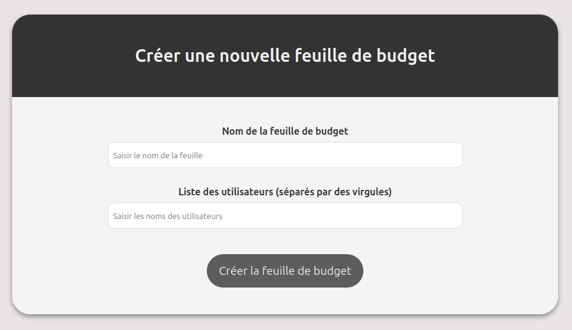

## 0. Prérequis

Avant de démarrer le projet, assurez-vous d'avoir:

    - Docker installé.
    - Docker Compose installé.

 

### Lancer les Services avec Docker Compose

Depuis un terminal dans le dossier racine, utilisez la commande suivante pour démarrer tous les services:

    docker-compose up --build

 

### Accédez au conteneur PostgreSQL pour vérifier les données:

Dans un autre terminal vous pouvez accéder aux informations stockées dans la base de données une fois tout les services actifs via la commande:

    docker exec -it bdd psql -U your_db_user -d budget_db

Une fois dans le shell PostgreSQL, vous pouvez exécuter les requêtes suivantes pour vérifier les données (par exemple):

    SELECT * FROM sheets;         -- Liste des budgets
    SELECT * FROM sheet_users;    -- Liste des utilisateurs associés aux budgets
    SELECT * FROM transactions;   -- Liste des transactions

 
    
### Arrêter et Redémarrer les Services

Pour arrêter les services:

    docker-compose down

Pour redémarrer les services et reconstruire les images si nécessaire:

    docker-compose up (--build)
    
Pour réinitialiser la base de données et les informations qu'elle contient:

    remove budget-app-main_db_data

  

# Application de Gestion de Budget Partagé

## 1. Arborescence du projet

├── auth/ 
│   ├── auth.js 
│   ├── Dockerfile 
│   └── package.json 
│ 
├── backend/ 
│   ├── app.js 
│   ├── Dockerfile 
│   ├── init.sql 
│   └── package.json 
│ 
├── frontend/ 
│   ├── src/ 
│   │   ├── App.js 
│   │   └── index.js 
│   ├── public/ 
│   │   ├── styles.css 
│   │   ├── script.js 
│   │   └── index.html 
│   ├── Dockerfile 
│   └── package.json 
│ 
├── img/ 
│   ├── psql.png 
│   └── ... 
│ 
├── login-frontend/ 
│   ├── src/ 
│   │   ├── App.js 
│   │   └── index.js 
│   ├── public/ 
│   │   ├── styles.css 
│   │   ├── script.js 
│   │   └── index.html 
│   ├── Dockerfile 
│   └── package.json 
│ 
├── nginx/ 
│   └── default.conf 
│ 
├── docker-compose.yml 
└── README.md 

  

## 2. Présentation de l'application

Cette application permet de gérer un **budget partagé** entre plusieurs utilisateurs. L'architecture de l'application repose sur plusieurs services Docker, chacun ayant un rôle spécifique dans le fonctionnement global de l'application. Ces services incluent :
- Un **frontend principal** pour la gestion du budget.
- Un **frontend de connexion** pour l'authentification des utilisateurs.
- Un **backend API** pour gérer les budgets, les utilisateurs et les transactions.
- Un **service d'authentification** via Google OAuth.
- Une **base de données PostgreSQL** pour stocker les données.
- Un **reverse proxy Nginx** pour gérer les redirections et les requêtes HTTP.

  

## 3. Fonctionnalités principales

### Page de connexion :
- Permet à l'utilisateur de se connecter via Google.
- Si l'utilisateur est déjà connecté, il est redirigé vers le frontend principal. Sinon, il peut se connecter avec son compte Google.

### Frontend Principal :
- Après la connexion, l'utilisateur est redirigé vers l'interface principale où il peut :
  - Créer un budget.
  - Ajouter des transactions (montants, personnes concernées, descriptions).
  - Visualiser les transactions et les soldes des budgets.
  - Voir les utilisateurs associés à chaque budget.

### Backend API :
- Le backend expose plusieurs routes API pour gérer les budgets et les transactions (par exemples) :
  - `http://localhost:3001/api/sheets/` : Récupère la liste de tous les budgets.
  - `http://localhost:3001/api/sheets/:id` : Récupère un budget spécifique par ID.
  - `http://localhost:3001/api/sheets/:sheetId/transactions` : Récupère toutes les transactions pour un budget spécifique.
  - `http://localhost:3001/api/sheets/:sheetId/users` : Récupère tous les utilisateurs associés à un budget spécifique.

### Base de données :
- Une **base de données PostgreSQL** est utilisée pour stocker les budgets, les transactions et les utilisateurs. Elle est initialisée avec un fichier SQL au démarrage du service de base de données.

### Reverse Proxy avec Nginx :
- Nginx agit en tant que reverse proxy pour :
  - Diriger les utilisateurs vers le frontend de connexion ou le frontend principal en fonction de l'état d'authentification.
  - Gérer les requêtes API en les redirigeant vers le backend.

  

## 4. Architecture des Dockerfiles

L'application utilise **Docker** pour isoler les différentes parties du système. Voici un aperçu des services Docker et de leurs Dockerfiles :

### a. Service Authentification (`auth`)
- **Dockerfile** : Le service d'authentification utilise **Node.js** pour gérer l'authentification via **Google OAuth2**. Lors du démarrage, il expose le port `3002` et interagit avec le backend pour gérer les sessions utilisateurs.

### b. Backend (`backend`)
- **Dockerfile** : Le backend est construit avec **Node.js** et expose l'API sur le port `3001`. Il gère la logique des budgets et des transactions et interagit avec la base de données PostgreSQL.

### c. Frontend Principal (`frontend`)
- **Dockerfile** : Le service frontend principal utilise **React** générée à l'aide de **Node.js**. Une fois construite, Nginx sert cette application statique. Ce service expose le port `3017` et dépend des services **backend** et **auth**.

### d. Frontend de Connexion (`login-frontend`)
- **Dockerfile** : Ce service est une simple page de connexion qui redirige l'utilisateur vers l'authentification Google. Il expose le port `3000` et dépend du service **auth** pour gérer l'authentification.

### e. Nginx (`nginx`)
- **default.conf** : Ce fichier configure Nginx pour :
  - Agir en tant que reverse proxy en redirigeant les utilisateurs non authentifiés vers la page de connexion.
  - Servir les fichiers statiques du frontend principal après l'authentification.

### f. Base de données (`bdd`)
- **Image** : Utilisation de l'image officielle de **PostgreSQL**. Ce service expose le port `5432` et initialise la base de données avec un script `init.sql` situé dans le dossier **backend**.

  

## 5. Utilisation de Docker Compose

Le fichier `docker-compose.yml` permet d'orchestrer tous les services Docker. Voici un aperçu de la configuration des services et des ports exposés :

- **Frontend Principal** : Expose le port `3017` pour l'application principale.
- **Frontend de Connexion** : Expose le port `3000` pour la page de connexion.
- **Backend** : Expose le port `3001` pour l'API.
- **Authentification** : Expose le port `3002` pour le service d'authentification.
- **Base de Données (PostgreSQL)** : Expose le port `5432` pour la base de données.
- **Nginx** : Expose le port `8080` pour accéder à l'application via le reverse proxy.

  

## 6. Liens et accès

Les utilisateurs peuvent accéder aux différentes parties de l'application via ces ports selon l'état de leur connexion.

    - Nginx Reverse Proxy : localhost:8080
    - Frontend de Connexion : localhost:3000
    - Backend API : localhost:3001
    - Frontend Principal : localhost:3017

  

## 7. Test du système

### Connexion

Lorsqu'un utilisateur accède à l'application via `localhost:8080`, il est redirigé vers la **page de connexion** si aucune session n'est active. Cette page est servie par le service `login-frontend` via le port `3000`. La page comporte un bouton permettant à l'utilisateur de se connecter via son compte Google.

 

### Authentification

Une fois sur la page de connexion, l'utilisateur peut se connecter avec son compte Google. Si la connexion réussit, l'utilisateur est redirigé vers l'interface principale de l'application. (possibilité de passer cette étape en se rendant directement sur localhost:3017)

 

### Frontend Principal

Une fois connecté, l'utilisateur accède à l'**interface principale**, où il peut créer un budget, ajouter des transactions et gérer les utilisateurs associés aux budgets. Cette interface est servie par le service `frontend` via le port `3017`.

#### Création d'un budget

L'utilisateur peut créer un **nouveau budget** en renseignant le nom du budget et les utilisateurs associés. Par exemple, un groupe d'amis partant en vacances crée une feuille de budget "Vacances 2024" avec les utilisateurs suivants : Personne 1, Personne 2, Personne 3, Personne 4.

 

 

Une fois la feuille créée, elle apparaît sous la zone de création, et le budget initial est affiché à 0. Cette zone de création est **cliquable**, permettant d’accéder aux informations détaillées du budget, telles que les transactions et la gestion des utilisateurs.

 

#### Informations détaillées d'une feuille de budget

Lorsqu’un utilisateur clique sur un budget, il accède à une vue détaillée qui comporte plusieurs sections :

1. **Titre de la feuille de budget** :
   Le titre est affiché en haut de la page.

   

    

3. **Utilisateurs associés à la feuille** :
   La liste des utilisateurs associés au budget est affichée, permettant à l'utilisateur de voir qui participe au budget.

   

    

5. **Ajout de transactions** :
   L'utilisateur peut ajouter des transactions à ce budget, comme par exemple des paiements effectués pour le groupe.

   

    

7. **Détails des dettes** :
   Une zone permet de savoir combien chaque personne doit à d'autres participants, en fonction des transactions effectuées.

   

    

9. **Historique des transactions** :
   Toutes les transactions effectuées pour ce budget sont listées dans une section d’historique.

   

    

11. **Suppression du budget** :
   Une zone permet également de revenir en arrière ou de supprimer complètement la feuille de budget si nécessaire.

   

    

#### Ajout et suppression d'utilisateurs

L'utilisateur peut ajouter ou supprimer des personnes du budget. Par exemple, si une personne se joint au groupe, elle peut être ajoutée facilement.

**Ajout d'une personne** :
Dans cet exemple, Personne 5 a été ajoutée.

 

 

**Suppression d'une personne** :
Il est également possible de supprimer des personnes du budget, mais uniquement si aucune transaction ne leur est liée. Par exemple, Personne 2 et Personne 3 ont été supprimées dans cet exemple.

 

#### Ajout de transactions

Une fois que le budget est créé, les utilisateurs peuvent **ajouter des transactions** pour enregistrer les dépenses. Par exemple, si Personne 2 paie 100€ de péage pour le groupe, cela sera enregistré comme une transaction.

 

La transaction est ensuite mise à jour dans la section **historique des transactions** et également dans la zone des **dettes**.

 

Ainsi, Personne 1, Personne 3, et Personne 4 devront 25€ chacune à Personne 2 (100€ divisé par 4).

 

#### Ajouter d'autres transactions

Des **transactions supplémentaires** peuvent être ajoutées. Par exemple, si Personne 4 achète des pizzas pour 50€, cela sera également ajouté.

 

Les **dettes** sont mises à jour en conséquence.

 

#### Suppression d'une transaction

Il est également possible de supprimer une transaction en cas d'erreur. Par exemple, la transaction de péage peut être supprimée, et tout est mis à jour. Dans cet exemple, seul le paiement de 50€ pour les pizzas reste, et les dettes sont réajustées. Après cette modification, seul Personne 4 a payé 50€ pour les pizzas, et donc Personne 1, Personne 2 et Personne 3 doivent 12,5€ chacun à Personne 4.

 

#### Budget global

Lorsque l’utilisateur ferme la feuille de budget, le **budget global** total est affiché sur le côté de la feuille.

  

## 8. Conclusion

Ce projet repose sur une architecture Docker multi-services pour gérer l'authentification, le backend des données, et un frontend interactif. Grâce à Docker, chaque composant de l'application est isolé et peut être facilement déployé et géré. L'application offre une gestion complète des budgets partagés, avec des fonctionnalités d'ajout de transactions, de création de budgets, de gestion des utilisateurs, et de visualisation des données en temps réel. Les différentes requêtes API exposées par le backend permettent une interaction fluide avec la base de données et le frontend.
